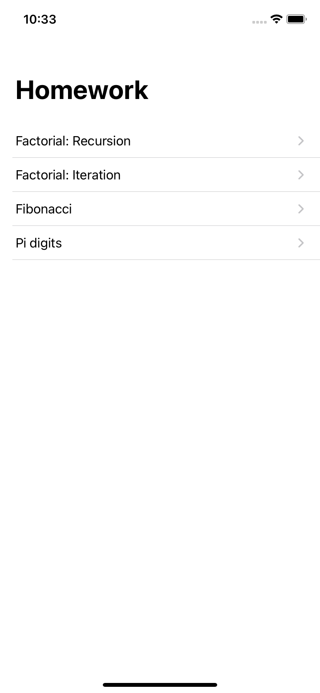
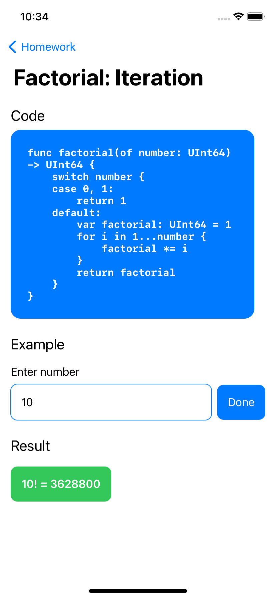
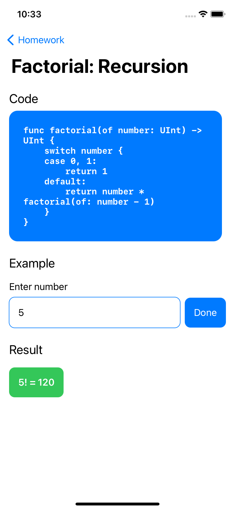
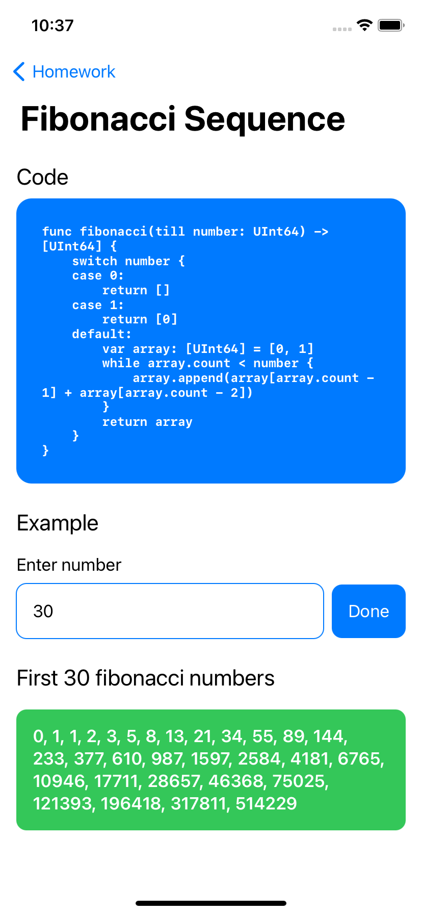
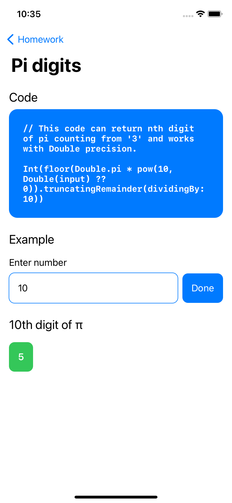

# Parimatch Tech Academy

## Homework 1

Student: **Vsevolod Pavlovskyi**

Made with SwiftUI

---

Screenshots:

<table>
    <tr>
        <td>Navigation View</td>
        <td>Factorial Iteration</td>
        <td>Factorial Recursion</td>
    </tr>
    <tr>
        <td></td>
        <td></td>
        <td></td>
    </tr>
    <tr>
        <td>Fibonacci Sequence</td>
        <td>Nth digit of Pi</td>
    </tr>
    <tr>
        <td></td>
        <td></td>
    </tr>
</table>

